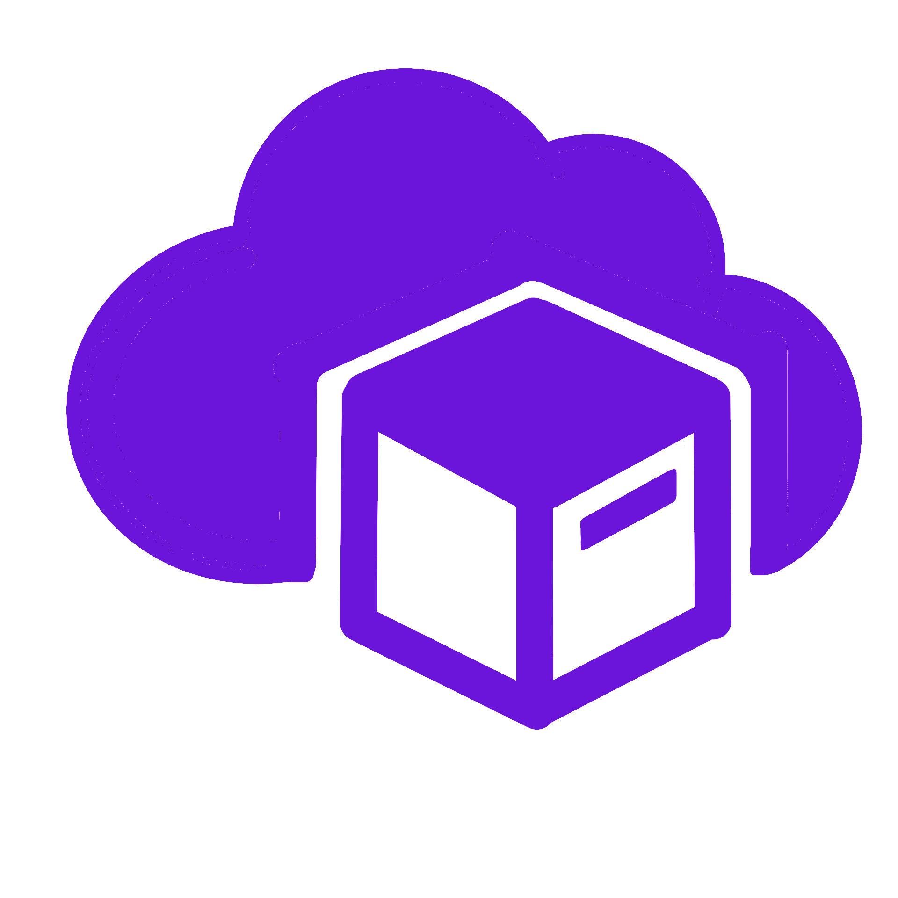

# 📦 ByteBox - Your Cloud, Your Space

<p align="center">
  
</p>

**ByteBox** is a powerful, modern, and responsive cloud storage web app built for seamless file management. From storing and sharing files of any type to exploring upload details and sorting intelligently — ByteBox does it all with style and simplicity.

🔗 **Live Demo**: [https://bytebox-snowy.vercel.app/](https://bytebox-snowy.vercel.app/)

---

## ✨ Features

- 🗂️ Upload and store files of any type
- 📥 Download files with a single click
- 🔗 Share files easily with other users
- 📄 View detailed info about uploaded files
- 🔍 Sort files by:
  - Name (A-Z / Z-A)
  - Upload time (newest / oldest)
- 📊 Intuitive dashboard with:
  - File list overview
  - Available storage space display
- 📱 Fully responsive design (works perfectly on mobile and desktop)
- 🔐 Custom login/sign-up system + Google OAuth
- 🎨 Smooth animations using [**Framer Motion**](https://motion.dev/)
- 🚨 Custom toast notifications for alerts, warnings, and success
- 🖼️ Icon support for file types via [Bootstrap Icons](https://icons.getbootstrap.com/)

---

## 🛠️ Tech Stack

### **Frontend**
- [Next.js](https://nextjs.org/) with **TypeScript**
- [TailwindCSS](https://tailwindcss.com/) for styling
- [Framer Motion](https://motion.dev/) for animations

### **Backend**
- [Node.js](https://nodejs.org/) with **TypeScript**
- REST API built for all core functionality

### **Storage**
- [MongoDB](https://www.mongodb.com/) for user and file metadata
- [Supabase Storage](https://supabase.com/) for actual file uploads

### **Authentication**
- Custom auth system (Login / Sign Up)
- Google OAuth integration for quicker access

---

<details>
<summary><strong>🚀 How To Run Project</strong></summary>

### 📦 Setup Instructions

1. **Download the project files** and open them in your code editor.

2. **Create a Supabase Account** at [supabase.com](https://supabase.com/)
   - Create an **Organization** and a **Project**
   - You will receive your `SUPABASE_KEY` and `SUPABASE_URL` — keep these safe.
   - Go to the **Storage** section and:
     - Create a **public bucket**
     - Go to **Policies → Full customization**
     - Create **3 policies**, select **all options**, and save each one

3. **Configure Bucket in Code**
   - Go to `backend/src/controllers/`
   - Search for `"box"` and replace it with your **bucket name**

4. **Update Supabase Credentials**
   - Go to `backend/src/controllers/DB/supabase.ts`
   - Replace `SUPABASE_URL` and `SUPABASE_KEY` with your actual credentials

5. **Set Up MongoDB Atlas**
   - Visit [MongoDB Atlas](https://www.mongodb.com/cloud/atlas/register)
   - Create an **account**, then an **organization** and **project**
   - Create a **cluster**
   - Click on **Connect → Compass** and follow the steps
   - This makes it easier to manage your database visually

6. **Set Up Google OAuth**
   - Visit [Google Cloud Console](https://console.cloud.google.com/)
   - Create a **project**, enable **OAuth Consent Screen**, and then create **OAuth Client ID**
   - In **Authorized JavaScript Origins**, add:
     - `http://localhost:3000`
     - `https://localhost:3000`
   - In **Authorized Redirect URIs**, add:
     - `http://localhost:3000`
     - `http://localhost:3000/sign-up`
     - `http://localhost:3000/sign-in`

7. **Configure Backend `.env` File**
   - In the `backend` folder, create a `.env` file with the following:
     ```env
     PORT=4000
     SECRET_KEY=your_secret_here
     MONGO_URL=your_mongodb_url/Next_Drive
     GOOGLE_ID=your_google_oauth_client_id
     SUPABASE_KEY=your_supabase_key
     SUPABASE_URL=your_supabase_url
     CLIENT_URL=http://localhost:3000
     ```
   - **Do NOT** share this file publicly.

✅ **Backend is now configured!**

---

### 🎯 Frontend Setup

8. In the `frontend` folder, create a `.env` file:
   ```env
   NEXT_PUBLIC_BASE_URL=http://localhost:4000
   NEXT_PUBLIC_GOOGLE_ID=your_google_oauth_client_id
✅ **Backend is now configured!**

---
### ⚙️ Running the Project
- Open a terminal in the `frontend` folder:
    ```terminal
    npm run dev
- Open a terminal in the `frontend` folder:
    ```terminal
    npm start
✅ **🎉 Congrats!**

Your ByteBox cloud storage app is now up and running locally!

</details>

## 🙋‍♂️ Author
**Aryan Gawade**
- 🔗 [LinkedIn](https://www.linkedin.com/in/siddharth-keer-30141011s003n004/)
- 🔗 [GitHub URL](https://github.com/Siddharth-Keer)